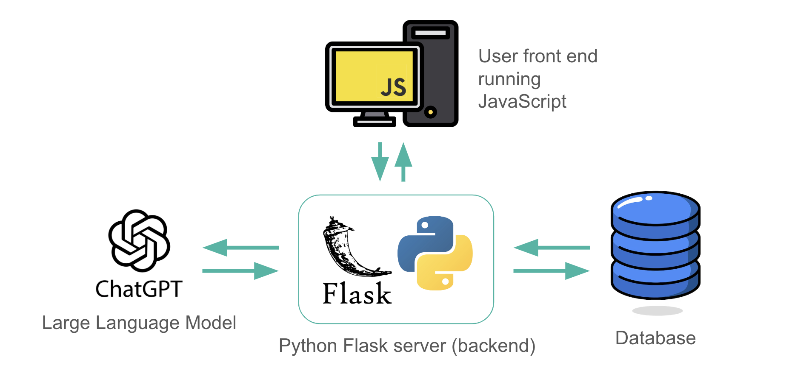
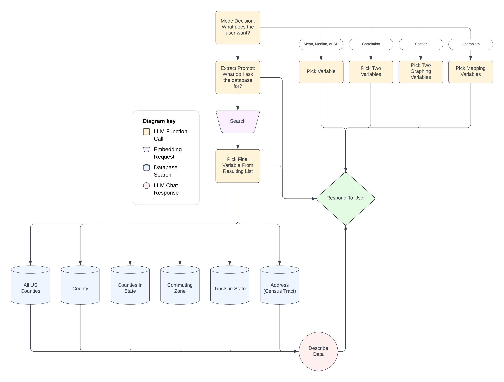

# Atlas Chat 🌐 👋

## Overview

Hello! Welcome to Atlas Chat. This README contains all the information you need to understand the code, run the website, and continue development. If you have any questions, please contact me at [maxlaibson@gmail.com](mailto:maxlaibson@gmail.com).

## Table of Contents

- [Features](#usage)
- [Installation](#installation)
- [Hosting](#hosting)
- [Structure](#structure)
- [Inner Workings](#inner-workings)
- [Problems & Possible Next Steps](#problems--possible-next-steps)
- [Contact](#contact)

## Features

Atlas chat is designed to help users explore [data](https://opportunityinsights.org/data/) from the [Opportunity Atlas Paper](https://opportunityinsights.org/paper/the-opportunity-atlas/). The chat can:

1. Find variables
    - Users can search for different topics, races, genders, and percentiles
2. Get location-specific data
    - Data is available for specific census tracts, counties, and commuting zones
    - Users can also get tables with variables for all US counties, all the counties in a specific state, or all the census tracts in a specific state
3. Calculate statistics
    - The chat can calculate the mean, median, standard deviation, and correlation
4. Make choropleth maps
    - Maps are available for all the counties in the US, all the counties in a state, and all the census tracts in a state
5. Make scatter plots
6. Answer questions

In addition to these features, Atlas Chat also has a dedicated data download page where users can download the variables mentioned in their conversations for different races, genders, percentiles, and geographic levels.

The website also has an error reporting feature that sends the contents of the chat along with the contents of the console and the user-entered error reporting message to a [FireStore](https://cloud.google.com/firestore?hl=en) database.

## Installation

First, clone this repository.

```bash
git clone https://github.com/xamxl/Atlas-Chat.git
```
Next, navigate to the Flask folder and install the Python requirements.

```bash
cd Atlas-Chat/Flask
pip install -r requirements.txt
```
You now need your own OpenAI API key and Google Cloud service account (If you want error reporting to work). You can get an OpenAI API key [here](https://platform.openai.com/docs/overview) and a service account [here](https://cloud.google.com/iam/docs/keys-create-delete). If you get a Google Cloud service account, put your JSON key into the atlas-chat-429014-31385e10f4b1.json file.

Now, run the Python file to start the server.

```bash
python main.py
```
Finally, navigate to the [localhost](http://127.0.0.1:3000/). Thats it! 🎉

## Hosting

While in the future any actual deployments of this website should have a separate database, cloud backend, and static website host, for now, if you want to quickly make a shareable link, you can just upload the whole program to [Google Cloud Run](https://cloud.google.com/run/?utm_source=google&utm_medium=cpc&utm_campaign=na-US-all-en-dr-bkws-all-all-trial-e-dr-1707554&utm_content=text-ad-none-any-DEV_c-CRE_665665924930-ADGP_Hybrid+%7C+BKWS+-+MIX+%7C+Txt-Serverless+Computing-Cloud+Run-KWID_43700077224933166-kwd-678836618089&utm_term=KW_google+cloud+run-ST_google+cloud+run&gad_source=1&gclid=Cj0KCQjwh7K1BhCZARIsAKOrVqGkYjouOnjAaTGADV02ZOaRybrk_BuAbY7DdY0i_b9Xr3Kin24g4tgaAuaIEALw_wcB&gclsrc=aw.ds&hl=en).

To do this, first, go to the script.js file in the project and replace all occurrences of http\:\/\/<i></i>127\.0\.0\.1\:3000\/ with the link to your Google Cloud Run deployment. You may need to deploy twice, once to figure out what this link is and another time with this link in the code.

Then set up a Google Cloud account and install the [Google Cloud SDK](https://cloud.google.com/sdk/docs/install). Navigate to the Flask folder and build the docker image.

```bash
cd OIP3/Flask
gcloud run deploy
```
You may have to wait a while for the files to upload, but after that, you should be all good to go. ☁️ 🔗

> [!WARNING]
> There is a bug in the code. Your deployment will return an error when you try to make a map of census tracts.

## Structure

The image below shows the structure of the program. The program is divided into four main parts. First, there is a webpage consisting of HTML, CSS, and importantly JS. This front end, which runs on the user's computer, can make requests to a backend server programmed in Python using the Flask library. The backend server can get data from the sheets stored in the database. Finally, the backend can make requests to the OpenAI API.



The rest of this section goes over the file structure of this repository and describes the purpose of each file.

In the base directory, flowchart.jpeg, structure.jpeg, and README.md are all files that help explain the code. The setup.py file contains code that was used to construct the database. The Flask folder contains the application itself. When running the program, the whole Flask folder is part of the execution. Inside the Flask folder there are loose files and there other directories.

First, the loose files. .env and atlas-chat-gcloud-key.json store the OpenAI API key and the google cloud service account key respectively. The .gitignore file prevents these sensitive files from being uploaded to github. countycode-countyname.csv stores a table converting county codes to county names. merged_data.csv is populated anew each time the server makes a graph, and there is no need to understand or monitor its contents. requirements.txt lists the Python packages that need to be installed to run the server. The server code itself is within main.py.

Second, the folders. Static and templates store the website code itself (the HTML, CSS, JS, and images that are given to the user's computer when it loads the page). These files are fetched for the user my main.py. The unzipped folder contains files with information about the outlines of US counties and census tracts. These are used when constructing maps. the sheets folder contains csv sheets, each with only one row. This row contains the header names for all the columns in that sheet. newSheets_1 contains the data itself. Each column from the original data was turned into its own sheet named with the number of the sheet the data comes from and then the variable name. NewHeader contains JSON files with descriptions for each variable. Their are only five files (less files then there are sheets) since many of the sheets have the same variables, just for different locations. Label-col-des holds the names of the label columns for each sheet. Examples of label columns are state id, state name, county name, and county id. The embedding folder contains the embeddings themselves. All columns in the sheets have a corresponding embedding, but each embedding normally corresponds to multiple columns. For example, kfr_pooled_pooled_mean and kfr_black_pooled_mean both have the same embedding. The embeddings for all label columns are set to zero.

## Inner Workings

This section explains how the code works. Please look through the following flowchart before reading the text since this section references the image. This section is an overview of the most important workflows in the chat. It does not go over every single function in the code.



### Mode Decision: What does the user want?

When the user sends a message to the chat, [sendMessage()](https://github.com/xamxl/Atlas-Chat/blob/main/Flask/static/js/script.js#L362) in script.js begins handling the request. The function adds the user's message to the `messages` list and calls [graphQM()](https://github.com/xamxl/Atlas-Chat/blob/main/Flask/static/js/script.js#L836) which makes a server call to determine which action the chat should take. [/useCase](https://github.com/xamxl/Atlas-Chat/blob/main/Flask/main.py#L648) in the server uses a function call from the OpenAI API to make the decision. This represents the first box in the flow chart. `sendMessage()` ultimately calls the right function(s) based on what branch of the flow chart the function call picks.

A function call is a way to get a regular formatted response from an LLM like chat-GPT. Instead of responding to a prompt with plain text, if a function call is used, the LLM either responds with plain text or with a JSON output representing the parameters to use to call a certain function. A programmer can specify that the LLM should always call a certain function and never return plain text.

### Pick Variable, Pick Two Variables, Pick Two Graphing Variables, Pick Mapping Variables

In these four branches of the flow chart, the chat decides that the user wants it to calculate a statistic or create a figure. `sendMessage()` calls the corresponding function. For illustration, this description will follow the branch the chat picks if it thinks the user wants to make a scatter plot.

In this case [requestGraphVars()](https://github.com/xamxl/Atlas-Chat/blob/main/Flask/static/js/script.js#L728) starts by calling [requestVar()](https://github.com/xamxl/Atlas-Chat/blob/main/Flask/static/js/script.js#L770) which constructs a list of all the available variables and sends them to the server. [/pickGraphVars](https://github.com/xamxl/Atlas-Chat/blob/main/Flask/main.py#L707) in the server uses a function call from the OpenAI API to decide which variables should be used or to write a message describing why the right variables were not available. Back in `requestGraphVars()` the chat either prints out the description of the right variables that were not found or calls [graphVariable()](https://github.com/xamxl/Atlas-Chat/blob/main/Flask/static/js/script.js#L1648) to create the graph with the variables the server selected.

### Extract Prompt: What do I ask the database for?

In this branch of the flow chart, `sendMessage()` starts by calling [variableSearch()](https://github.com/xamxl/Atlas-Chat/blob/main/Flask/static/js/script.js#L426). This function calls [/des](https://github.com/xamxl/Atlas-Chat/blob/main/Flask/main.py#L605) in the server which uses a function call from the OpenAI API to either directly respond to the user or fill out the fields required to search for a variable. These fields include race, gender, percentile, location, and query (the keywords to use in the search).

Back in `variableSearch()`, the chat either prints out the response from the server or gets the values of all the fields so that `sendMessage()` can call the right function to find variables for the user. For example, if the user asks a question like "What is a standard deviation?" then the chat will answer the question directly while in this part of the flow chart. If the user says, "Get me a median household income variable." then the flow chart will reach this stage and move on to Variable Search after it collects the search fields.

### Variable Search

In this branch of the flow chart, `sendMessage()` starts by calling [fetchData()](https://github.com/xamxl/Atlas-Chat/blob/main/Flask/static/js/script.js#L849) which calls [/chat](https://github.com/xamxl/Atlas-Chat/blob/main/Flask/main.py#L581) in the server with the key words the previous function call said should be used for the search. `/chat` calls [handle_chat_request_no_sheets()](https://github.com/xamxl/Atlas-Chat/blob/main/Flask/main.py#L246). `handle_chat_request_no_sheets()` starts by finding the embedding values using the of the keywords the function call thought should be used in the search. To find the embedding values it uses the OpenAI API.

Embeddings are vectors that represent the meaning of text. Since vectors consist of numbers, embeddings can be easily used to compare the distances between different texts (how similar the meanings of two texts are).

`handle_chat_request_no_sheets()` then gets a set of embeddings that correspond to a set of all variables in the database and their descriptions. These embeddings were calculated once when the server code was written. They are not calculated every time `handle_chat_request_no_sheets()` runs. The function then calculates another type of distance, dubbed "dumb distance." "Dumb distance" is the fraction of the keywords that appear in each of the descriptions of the variables in the database.

The two different distance metrics are combined, weighting the cosine similarity by 0.8 and the dumb distance by 0.2. The cosine similarity embedding distance is used so that terms like "upward mobility" which does not appear in the variable descriptions can be matched with text from the descriptions which has a similar meaning. The "dumb distance" is used so that terms like "individual" which appear in many descriptions can be exactly matched.

`handle_chat_request_no_sheets()` then gets all the variable headers from all the sheets and returns a list with them ordered by the distance metric. The lower the index of a header, the closer the header is to the keywords. The headers also contain information about the sheet they are from and the description of the variable. For example, one of the descriptions with an embedding and distanced could be "hs - the fraction of children who completed high school". This would match with all the related headers like hs_pooled_pooled_mean, hs_black_pooled_mean, and hs_white_pooled_mean.

The front end receives the resulting list and `sendMessage()` calls  [processChatData()](https://github.com/xamxl/Atlas-Chat/blob/main/Flask/static/js/script.js#L879) which puts the variables into a hidden HTML table to make processing easier.

`sendMessage()` then calls [condense()](https://github.com/xamxl/Atlas-Chat/blob/main/Flask/static/js/script.js#L1033) which removes duplicates from the table that have the same title but different races, genders, and percentiles. It saves the different race, gender, and percentile options for each variable to lists. For example, if kfr_black_pooled_p50 and kfr_black_pooled_p25 are both in the data, only one will be kept.

`sendMessage()` then calls [chooseDropdown()](https://github.com/xamxl/Atlas-Chat/blob/main/Flask/static/js/script.js#L919) which makes sure that the race, gender, and percentile values for each variable are in line with the fields filled out by `/des`. For example, if `condense()` took in hs_pooled_pooled_mean, hs_male_pooled_mean, and hs_female_pooled_mean and removes both hs_male_pooled_mean and hs_female_pooled_mean but `/des` specified that the user wants the data for females only, `chooseDropdown()` will replace hs_pooled_pooled_mean with hs_female_pooled_mean.

`sendMessage()` then calls [linkRows()](https://github.com/xamxl/Atlas-Chat/blob/main/Flask/static/js/script.js#L104) which reorders the tables so "families" are together (or "linked"). For example, if kfr_pooled_pooled_mean and kfr_pooled_pooled_p50 are both in the table but are not next to each other, then `linkRows()` will move the one farther from the top of the table to be next to the other. `linkRows()` also adds text to the descriptions of variables ending in "_n", "_se", "_p50", and "_p25" to make sure the chat understands what these variables mean. These additions are not visible to the user. Finally, the function returns a string listing the top 10 variables and their descriptions in the table. The value of 10 can easily be changed. The larger this number is, the more variables chat-GPT will have to choose from. This makes chat-GPT better at picking a good variable but increases the cost of the function call.

### Pick Final Variable From Resulting List

The next function called by `sendMessage()` is [answerQuestionContinued()](https://github.com/xamxl/Atlas-Chat/blob/main/Flask/static/js/script.js#L1214). This function calls [/pickVarAndDescribe](https://github.com/xamxl/Atlas-Chat/blob/main/Flask/main.py#L631) in the server which uses a function call from the OpenAI API to decide which of the variables returned by `linkRows()` to use. Along with its choice, the function call also returns a description of the variable. 

If the function call does not find a suitable variable, back in `answerQuestionContinued()` the chat will print an error message to let the user know no variable was found. If a variable was found and no location was specified by the user, the chat displays the resulting variable along with its description. 

### All US Counties, County, Counties in State, Commuting Zone, Tracts in State, Address (Census Tract)

If a location was specified by the user then `sendMessage()` calls [getLocationData()](https://github.com/xamxl/Atlas-Chat/blob/main/Flask/static/js/script.js#L1388). This function takes different actions depending on what type of location was requested. This description follows the branch of the flow chart where the user requested data for "All US Counties".

In this case, `getLocationData()` calls [fetchDataLoc()](https://github.com/xamxl/Atlas-Chat/blob/main/Flask/static/js/script.js#L1487) which calls [/getData](https://github.com/xamxl/Atlas-Chat/blob/main/Flask/main.py#L596) in the server which finds the correct data and returns it to the front end along with its units. The returned data is a table consisting of the variable the function call decided was best along with the label columns, which in this case would include the county id and the county name. The data can be fetched quickly because each variable or label column is stored in its own sheet which is named according to the header of the column. `getLocationData()` then adds the resulting data to the chat while keeping it hidden.

### Describe Data

Finally, after the data is fetched, `sendMessage()` calls [answerQuestionContinuedLocDes()](https://github.com/xamxl/Atlas-Chat/blob/main/Flask/static/js/script.js#L1340) which then calls [/chatData](https://github.com/xamxl/Atlas-Chat/blob/main/Flask/main.py#L588) in the server. `/chatData` uses a direct request, instead of a function call, to ask the OpenAI API to describe the data. The server then returns the description to the front end which displays the variable, location-specific data, and description to the user.

## Problems & Possible Next Steps

This section outlines some of the key problems with the chat right now and some ways that these problems could be fixed.

Sometimes when the variable the user wants is not one of the top 10 variables returned by `linkRows()` the function call in `/pickVarAndDescribe` still returns the name of the variable that the user wants. Right now this causes the chat to break because the code can't find the variable from the function call in the list of possible variables. This could be fixed by making the chat directly search for variable names that are returned by the function call in `/pickVarAndDescribe` but are not in the list of possible variables created by `linkRows()`. If "Pick Final Variable From Resulting List" fails after the function call in `/pickVarAndDescribe` returns a name, then the chat should first try finding that variable directly from the database before returning an error.

To save money, the function call in `/useCase()` is only given one message to use when deciding which action to take. Since it's missing most of the context of the chat, the function call sometimes decides to take the wrong action. Since the OpenAI API has already gotten much cheaper, it makes sense to give `useCase()` more messages to use when deciding which action to take.

By the time someone reads this there will likely be new LLMs and embedding models that perform better than the ones used in this code. Research the best LLMs and embedding models and replace the models currently being used with the new ones. Specifically, try looking for chat-GPT 5 and for [llama 3.1 405B hosted by Groq](https://console.groq.com/docs/models). Along these lines, the function calling feature of chat-GPT should be updated to use the new [Structured Output](https://platform.openai.com/docs/guides/structured-outputs/introduction) feature.

## Contact

- [GitHub](https://github.com/xamxl)
- [Email](mailto:maxlaibson@gmail.com)